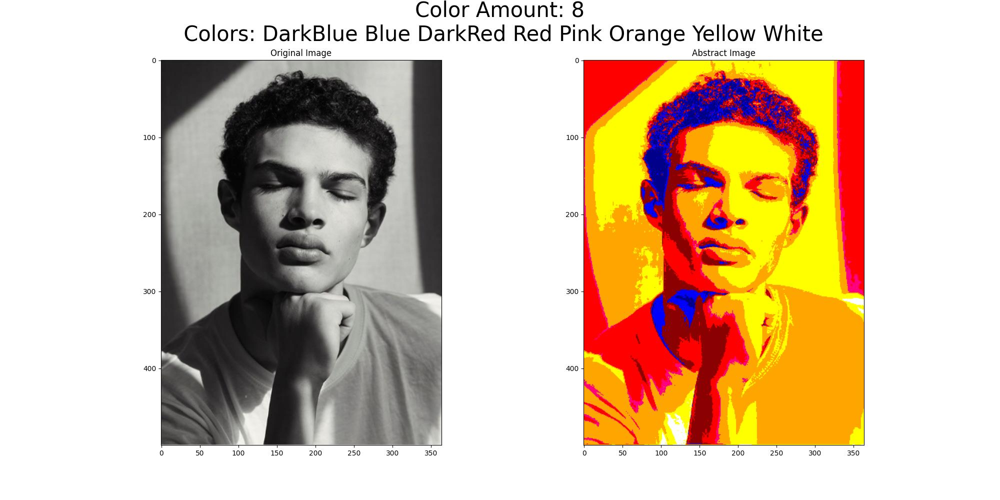

# Art Image Generator

This repository contains a Python script that converts images into abstract art by manipulating their color profiles.

## Features

- Image processing to convert standard images into abstract art.
- User interaction for dynamic color changing within the images. (Just click at the color to change it)
- Data saving for user preferences and image properties in CSV format.
- Visualization of original and transformed images side by side.
- Interactive color changing by clicking on the image.

## Installation

To run the scripts, you need Python installed on your system. The code has been tested with Python 3.8, but it should be compatible with other versions that support the libraries used.

1. **Clone the Repository**
git clone git@github.com:CastIehard/Image_2_Art.git

2. **Install Required Libraries**
- Ensure you have `pip` installed on your system.
- Install the required libraries using:
  ```
  pip install -r requirements.txt
  ```
This command will install all necessary libraries listed in `requirements.txt` file, including OpenCV, Pandas, Numpy, and others.

## How It Works

The script performs the following steps:
- Reads a random image from the `Source_Images` directory.
- Calculates the luminance (brightness) of each pixel and maps it to a new color based on predefined color profiles.
- Allows the user to interactively change colors in the generated abstract image by clicking on specific pixels.
- Saves the user-rated abstract images and their ratings in a CSV file and as JPEG files in the `Art_Images` directory.

Users can interact with the program through the command line, making selections to adjust image properties and finalize their choices.

### Click-to-Change Color Feature

When viewing the abstract image, users can click on any pixel to change its color. This feature utilizes the `mouse_event` function, which is triggered by mouse clicks on the image display:
- The script captures the coordinates of the click, identifies the color at that pixel, and replaces it with a randomly selected new color from the available set not currently used in the image.
- This allows real-time modifications and lets users experiment with different color schemes directly.

## Example

An example image called `example.jpg` is included in the repository to demonstrate the initial input for the art transformation. Below is how this example image looks:



## License

This project is open-sourced under the MIT License. See the `LICENSE` file for more details.

## Contributing

Contributions to this project are welcome. Please ensure to update tests as appropriate.

## Authors

- Luca Burghard

Feel free to contact me at my luca@castlehard.com for any further questions about this project.
